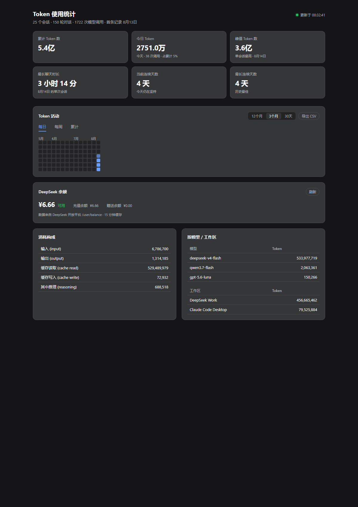

# dsh-token-stats

Token usage statistics plugin for DeepSeek Harness (DSH). It parses real provider usage data from DSH session logs (`session.jsonl.zstd`) and provides complete usage statistics inside the Web GUI: cumulative / today / peak tokens, longest chat duration, streak days, and a 12-month activity heatmap (daily / weekly / cumulative), broken down by model and workspace.



## Features

### Stat cards (6 cards, 3×2 grid)

The page opens with six key figures in a symmetric 3-column × 2-row grid (2 columns on narrow screens):

| Card | Meaning |
|---|---|
| Cumulative tokens | Full total of input + output + cache read + cache write |
| Today's tokens | Usage so far today, with the call count and its **share of the cumulative total** |
| Peak tokens | Highest single-session consumption, with the date it happened |
| Longest chat | Longest continuous chat session (sessions are split after 30 minutes of inactivity) |
| Current streak | Consecutive active days ending today (or yesterday) |
| Longest streak | Best consecutive-active-days run on record |

An "active day" is any day with at least one token-consuming call.

### Activity heatmap

A GitHub-style 7-row calendar grid (Mon–Sun) over a rolling 12-month window, with two freely combinable dimensions:

- **Three views**:
  - **Daily**: each cell is that day's usage
  - **Weekly**: each cell is its week's total (the whole 7-cell column lights up, so an active week reads at a glance)
  - **Cumulative**: each cell is the running total up to that day (a left-to-right gradient ramp)
- **Time range**: 12 months / 3 months / 30 days, 3 months by default (so sparse data does not leave the calendar mostly empty)
- **Hover preview**: a bubble shows "8月13日 使用了 6391.7万个 Token（58 次调用）"; empty days show "无使用"
- **Click to drill down**: in the daily view, clicking a day cell opens that day's detail dialog — every session's tokens and calls for the day, **labeled with the session title** (so you can tell which session it is), repeated titles **auto-merged** with a ×N count, **paginated 10 rows per page**; with the dialog open you can click other dates to switch directly
- **CSV export**: one-click export of the current range as per-day rows (date / tokens / calls), with a UTF-8 BOM so Excel opens it without garbled text

### Consumption breakdown

Input / output / cache read / cache write / reasoning with **full-precision numbers** (thousand separators, no 万/亿 abbreviation) — exact figures when you need them. (Cache read is DeepSeek's prefix-cache hits; it usually dominates the total but bills far below input.)

### By model / workspace

Per-model and per-workspace consumption rankings with full-precision numbers, so you can see at a glance which model and which project directory consume the most.

### Live session badge

Two pills sit in the conversation header, always visible:

- **本会话 X**: the current session's token usage, polled every 10 seconds; click for the session detail dialog (total / input / output / cache / reasoning, a per-model breakdown, and the **session title**), with a one-click shortcut to the full statistics
- **¥ balance**: the DeepSeek account balance, polled every 15 minutes; clicking **force-refreshes the balance** and opens the dedicated balance dialog

### DeepSeek account balance

The balance appears in three places, each with its own purpose:

1. **Header balance pill**: next to the session badge, visible at all times
2. **Dedicated balance dialog**: opened by clicking the pill — a large amount with availability status, topped-up / granted breakdown, a **refresh** button, and the data source / last-updated time
3. **Balance panel on the full stats page**: a compact full-width strip below the heatmap, with its own refresh button

Refresh behavior: clicking refresh forces a live query to the DeepSeek open platform (`/user/balance`) via `?force=1`, with a "刷新中…" state on the button; a 15-minute poll is the baseline; on failure the last cached value is kept (no flicker). **The API key is resolved through the DSH credentials service and stays in the host process — it is never sent to the browser.**

### Standalone stats page

`http://127.0.0.1:3080/token-stats`: the same dark-themed full statistics page as the GUI, directly accessible without opening the GUI, auto-refreshing every 15 seconds, with heatmap / balance / breakdowns / export / drill-down all working.

**Balance warning**: when the balance drops below the configured threshold (¥5 by default, `balanceWarnThreshold`, 0 disables it), the header pill dot turns red and the balance dialog / stats-page panel show a red "余额不足" state with a top-up reminder, so calls never fail silently on an exhausted balance.

## Data source

All figures come from real provider usage recorded in DSH session logs (`inputTokens` / `outputTokens` / `cacheReadTokens` / `cacheWriteTokens` / `reasoningTokens`) — no estimation, no traffic interception. On startup the plugin replays historical session logs, captures new usage live via `session/event`, and reconciles incrementally every 30 seconds.

Data is stored at `$DSH_HOME/token-stats/usage.jsonl` (`$DSH_HOME` is the DSH data root; it defaults to `~/.dsh` or the `DSH_HOME` environment variable).

## Configuration

Tunables are overridden through `$DSH_HOME/token-stats/config.json` (defaults apply when absent):

```json
{
  "gapMs": 1800000,
  "rescanIntervalMs": 30000,
  "balanceCacheMs": 900000,
  "windowMonths": 12,
  "defaultRange": "3m",
  "balanceWarnThreshold": 5
}
```

| Key | Default | Meaning |
|---|---|---|
| `gapMs` | 1800000 (30 min) | Inactivity gap that splits a session into separate chats |
| `rescanIntervalMs` | 30000 (30 s) | Session-log reconciliation interval |
| `balanceCacheMs` | 900000 (15 min) | Balance query cache TTL |
| `windowMonths` | 12 | Full heatmap window in months |
| `defaultRange` | `3m` | Default heatmap range (`12m`/`3m`/`30d`) |
| `balanceWarnThreshold` | 5 (¥) | Red balance warning below this amount (0 disables) |

Restart DSH after editing; the effective config is exposed at `GET /token-stats/api/config`.

## Tests

```bash
pnpm test
```

Vitest suite covering zstd multi-frame decoding, log parsing, aggregation, store dedupe/merge, config merging and the balance service (24 cases, fixture data, no live logs).

## Installation

The plugin mounts through DSH's profile plugin mechanism (managed by `dsh plugin`, the same mechanism as `@liustack/modlens`):

1. Add the dependency and bundle entry in the web profile's `package.json`:

```jsonc
// data/profiles/web/package.json
{
  "dependencies": {
    "dsh-token-stats": "link:../../path/to/dsh-token-stats"   // or file:, or a version once published to npm
  },
  "dsh": {
    "profile": {
      "bundles": ["@deepseek-ai/dsh-base", "@deepseek-ai/dsh-web-app", "dsh-token-stats"]
    }
  }
}
```

2. Run `pnpm install` in the profile directory
3. Restart DSH (exit and relaunch)

## HTTP API

| Endpoint | Description |
|---|---|
| `GET /token-stats/api/stats` | Full stats snapshot (everything the cards / heatmap / breakdowns need) |
| `GET /token-stats/api/balance` | DeepSeek account balance (15-minute cache; `?force=1` to bypass) |
| `GET /token-stats/api/day?date=YYYY-MM-DD` | Per-session usage for one date (heatmap drill-down) |
| `GET /token-stats/api/session/<sessionId>` | Single-session usage summary (used by the badge / dialog) |
| `GET /token-stats` | Standalone stats page (HTML) |

## Package structure

```
dsh-token-stats/
├── package.json          # dsh.bundle.patch (host mount) + dsh.client (browser half)
├── cordis.patch.yml      # plugin loading config
├── dsh/                  # host half: log scanning, aggregation, HTTP routes
│   ├── index.js          # apply(ctx): boot backfill + live capture + routes
│   ├── scan.js           # session-log scanning and usage extraction
│   ├── stats.js          # aggregation (cumulative / peak / heatmap / streaks / today / sessions)
│   ├── zstd.js           # multi-frame zstd decoding (session logs are frame-appended)
│   ├── store.js          # usage.jsonl persistence and migration
│   ├── home.js           # DSH data root resolution
│   └── page.js           # standalone stats page
└── client/               # browser half: settings page + session badge + dialogs
    └── bundle.js         # web shell loader format, hand-written, no build step
```

## License

[MIT](LICENSE)
